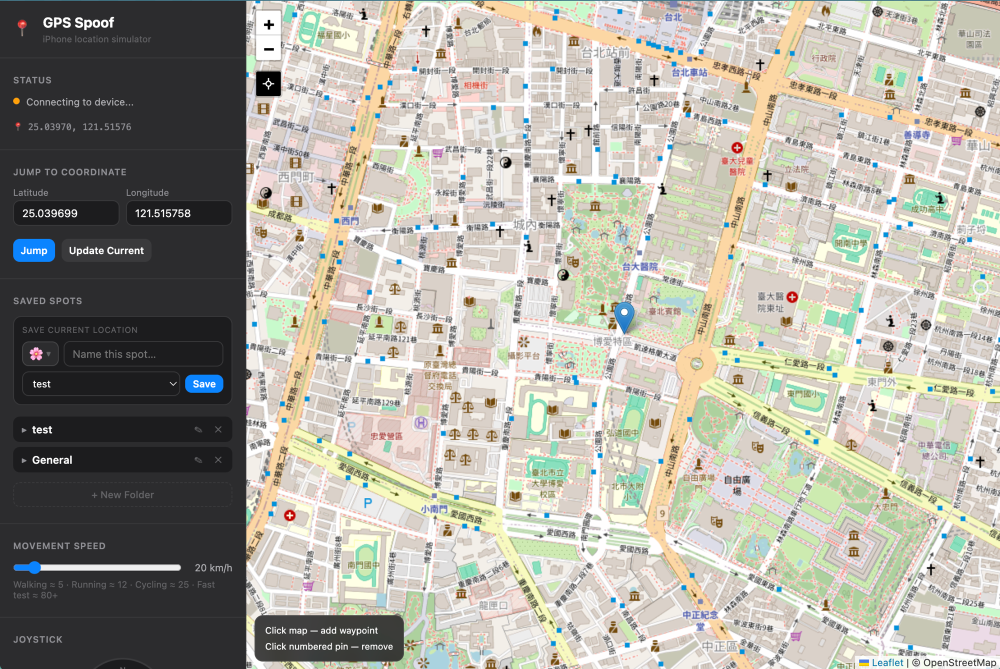

# 📍 GPS Spoof — 用 Mac 偽造 iPhone 的 GPS 位置

> 不需要越獄，不需要工程背景，照著步驟就可以把 iPhone 的 GPS 定位偽裝到世界上任何地方。

> **📌 使用方式：** 用 USB 線把 iPhone 接到 Mac，在 Mac 上執行這個工具，即可從 Mac 的瀏覽器控制 iPhone 的 GPS 位置。**Android 手機不適用。**



---

## 在開始之前，先看這裡 👀

這個工具讓你可以：
- 打開地圖，點擊任意地點，iPhone 的 GPS 立刻移動過去
- 用虛擬搖桿控制移動方向，就像玩電動一樣
- 設定一連串路線點，自動沿路走
- 儲存常用地點到收藏夾，一鍵跳過去

**誰適合用：** Pokémon GO、旅遊類遊戲、測試 App 定位功能、任何需要假裝在其他地方的場合。

**完全不需要：** 越獄、Xcode、購買任何東西、工程師背景。

---

## 目錄

- [你需要準備什麼](#-你需要準備什麼)
- [第一次設定（一次性）](#-第一次設定一次性)
- [每次使用的步驟](#-每次使用的步驟)
- [Web UI 功能介紹](#-web-ui-功能介紹)
- [常見問題與解決方法](#-常見問題與解決方法)
- [English Reference](#-english-reference)

---

## 📋 你需要準備什麼

開始前，請確認你有以下東西。**缺一不可。**

### 硬體

**1. 一台 Mac 電腦**
- 任何型號都可以（MacBook、iMac、Mac mini 等）
- macOS 版本：在 Mac 左上角點 🍎 → **關於這台 Mac**，確認版本是 12.0（Monterey）或以上

**2. 一支 iPhone**
- iOS 版本建議 16 或以上
- 確認方式：iPhone 設定 → 一般 → 關於本機 → 軟體版本

**3. 一條支援「資料傳輸」的 USB 線（非常重要！）**

> ⚠️ **市面上很多 USB 線只能充電，不能傳輸資料，這種線沒辦法用！**
>
> **怎麼判斷你的線是否支援資料傳輸？**
> 1. 把 iPhone 接上 Mac
> 2. iPhone 螢幕出現「**要信任這台電腦嗎？**」→ ✅ 這條線可以用
> 3. iPhone 只出現充電閃電圖示，什麼也沒問 → ❌ 這條線不行，請換一條

<!-- 📷 建議截圖：iPhone 螢幕出現「要信任這台電腦嗎？」的彈窗 -->

---

### 軟體（免費，需要安裝一次）

**Python 3.10 以上版本**

Python 是一個讓電腦跑程式的工具，這個 GPS 工具需要它才能運作。

**怎麼確認你有沒有裝：**
1. 打開**終端機**（見下方說明）
2. 輸入 `python3 --version` 然後按 `Return`（Enter）
3. 看到 `Python 3.10.x` 或更高的數字 → ✅ 已安裝，可以跳過這步
4. 看到錯誤訊息或版本低於 3.10 → ❌ 需要安裝

**如何安裝 Python：**
1. 用瀏覽器前往 [python.org/downloads](https://www.python.org/downloads/)
2. 點擊大大的黃色 **Download Python** 按鈕
3. 下載完成後，雙擊下載的 `.pkg` 檔案
4. 按照螢幕上的指示，一直點「繼續」和「安裝」
5. 安裝完成後，**重新開啟終端機**，再次輸入 `python3 --version` 確認

---

<details>
<summary>📌 備註：什麼是「終端機」？（點擊展開）</summary>

終端機是 Mac 裡的一個程式，讓你用文字指令控制電腦。你不需要了解它怎麼運作，只需要知道怎麼開啟、怎麼貼上指令、怎麼按 `Return`。

**打開終端機的方法：**

**方法 A（推薦）：**
1. 按下鍵盤上的 `Command（⌘）` + `空白鍵（Space）`
2. 搜尋框出現後，輸入「終端機」或「Terminal」
3. 按 `Return` 開啟

**方法 B：**
1. 開啟 **Finder**（就是那個藍色臉的圖示）
2. 點選左側「應用程式」
3. 找到「工具程式」資料夾
4. 裡面有「終端機」，雙擊開啟

終端機打開後，你會看到一個黑色（或白色）視窗，裡面有一個等待你輸入的游標。

**使用小技巧：**
- 貼上指令：`Command（⌘）+ V`
- 執行指令：按 `Return`（就是 Enter 鍵）
- 中斷正在執行的程序：按 `Control（⌃）+ C`
- 如果輸入密碼，畫面**不會顯示任何字元**，這是正常的，輸入完按 `Return` 就好

<!-- 📷 建議截圖：打開的終端機視窗（空白狀態） -->

</details>

---

## 🛠️ 第一次設定（一次性）

以下步驟只需要做一次，之後每次使用不需要重複。

### 步驟 A — 安裝必要的程式套件

1. 打開終端機
2. 把以下整行文字**複製**起來：
   ```
   pip3 install pymobiledevice3
   ```
3. 貼到終端機視窗中（`Command + V`）
4. 按 `Return`
5. 終端機會開始顯示一堆文字在跑，**這是正常的**，耐心等待
6. 等到你看到 `Successfully installed ...` 這樣的文字出現 → ✅ 安裝成功

<!-- 📷 建議截圖：終端機顯示 "Successfully installed pymobiledevice3..." 的畫面 -->

> **遇到錯誤 `Permission denied`？** 改用這個指令：
> ```
> pip3 install --user pymobiledevice3
> ```

> **遇到錯誤 `pip3: command not found`？** 改用：
> ```
> pip install pymobiledevice3
> ```

---

### 步驟 B — 在 iPhone 上開啟「開發者模式」

這個設定讓 Mac 的程式可以跟 iPhone 通訊。（iOS 16 以上才需要做這步，舊版本不需要）

1. 先用 USB 線把 iPhone 接上 Mac
2. iPhone 螢幕如果出現「要信任這台電腦嗎？」，點擊**信任**，然後輸入 iPhone 解鎖密碼
3. 在 iPhone 上打開 **設定**（那個灰色齒輪圖示）
4. 往下捲，找到並點擊 **隱私權與安全性**
5. 繼續往下捲到最底部
6. 找到 **開發者模式**，點進去
7. 把開關**打開**（滑到綠色）
8. 出現警告說要重新啟動，點擊 **重新啟動**
9. iPhone 重啟後，再次打開設定 → 隱私權與安全性 → 開發者模式，確認是**開啟**狀態

<!-- 📷 建議截圖：iPhone 設定中「開發者模式」開關為開啟（綠色）的畫面 -->

> **找不到「開發者模式」？** iOS 15 或更早版本不需要這個設定，可以跳過。

---

### 步驟 C — 下載本工具

1. 在這個 GitHub 頁面，點擊右上角的綠色 **Code** 按鈕
2. 點選 **Download ZIP**
3. 下載完成後，在 Finder 中找到下載的 ZIP 檔案，雙擊解壓縮
4. 把解壓縮後的資料夾移動到你容易找到的地方，例如「文件（Documents）」資料夾裡

---

## 🚀 每次使用的步驟

每次想要使用 GPS 模擬，都要照以下步驟操作。總共需要開啟**兩個終端機視窗**和**一個瀏覽器**。

---

### 步驟 1 — 連接 iPhone

1. 用 **資料傳輸 USB 線** 把 iPhone 接上 Mac
2. 確認 iPhone 螢幕是**亮著的且已解鎖**（不是在黑色鎖定畫面）
3. 如果 iPhone 出現「**要信任這台電腦嗎？**」，點擊**信任**，再輸入 iPhone 解鎖密碼
4. 確認連接成功：打開 Mac 上的 **Finder**，左側應該看到 iPhone 的名稱

<!-- 📷 建議截圖：Finder 左側顯示 iPhone 名稱的畫面 -->

---

### 步驟 2 — 開啟終端機 1，建立通道

> 這個視窗**整個使用期間都要保持開著**，不能關閉。

1. 打開一個**新的終端機視窗**
2. 複製以下指令，貼到終端機，按 `Return`：
   ```
   sudo python3 -m pymobiledevice3 remote start-tunnel
   ```
3. 出現「**密碼：**」提示時，輸入你的 **Mac 開機登入密碼**
   - 輸入時畫面不會顯示任何字元，這是正常的
   - 輸入完後按 `Return`
4. 等待幾秒鐘，直到看到類似這樣的文字：
   ```
   RSD Address: fd1a:48e:cc16::1
   RSD Port:    58981
   ```
5. **把這兩行資訊抄下來（或截圖）**，下一步會用到
   - `RSD Address` 是一串數字和字母的組合
   - `RSD Port` 是一串純數字

<!-- 📷 建議截圖：終端機 1 顯示 RSD Address 和 RSD Port 的完整輸出 -->

> ⚠️ **注意：** 這兩個數字每次連接都會不一樣！每次使用都要重新看終端機的輸出，不能用上次的舊數字。

> **等了很久都沒看到 RSD Address？** 試試看：
> - 確認 iPhone 已解鎖（螢幕要亮著）
> - 拔掉 USB 線再重新插上
> - 確認已點了「信任這台電腦」

---

### 步驟 3 — 開啟終端機 2，啟動 GPS 伺服器

1. 打開**另一個新的終端機視窗**（不要關掉剛才的終端機 1）
   - 在終端機選單點 **Shell** → **新增視窗**，或按 `Command + N`
2. 切換到工具所在的資料夾。在終端機輸入 `cd ` （注意 cd 後面有一個空格），然後：
   - 打開 **Finder**，找到你放 GPSSpoofMac 的資料夾
   - 把那個資料夾**直接拖進終端機視窗**（拖到那個 `cd ` 後面的位置）
   - 路徑會自動填入，按 `Return`
3. 現在輸入以下指令（把 `<RSD_ADDRESS>` 換成步驟 2 抄下來的 RSD Address，把 `<RSD_PORT>` 換成 RSD Port）：
   ```
   python3 gps_spoof.py --rsd <RSD_ADDRESS> <RSD_PORT>
   ```

   **舉例（你的數字會不一樣）：**
   ```
   python3 gps_spoof.py --rsd fd1a:48e:cc16::1 58981
   ```

4. 按 `Return`，等待看到這行文字：
   ```
   Device connected. Ready to spoof.
   ```
   
   出現這行 → ✅ 成功！iPhone 已準備好接受 GPS 模擬

<!-- 📷 建議截圖：終端機 2 顯示 "Device connected. Ready to spoof." 的畫面 -->

> **等了一分鐘還沒出現 `Device connected`？** 可能原因：
> - RSD Address 或 RSD Port 抄錯了（注意大小寫，數字不能有多餘空格）
> - 終端機 1 被意外關閉了，請重新開啟
> - iPhone 螢幕鎖定了，解鎖後再試

---

### 步驟 4 — 開啟控制介面

1. 打開 **Safari**、**Chrome** 或任何瀏覽器
2. 在網址列輸入（就是平常輸入網址的地方）：
   ```
   http://localhost:8765
   ```
3. 按 `Return`
4. 你會看到一個地圖介面：左側是控制面板，右側是地圖
5. 確認左側面板最上方的小圓點變成**綠色** ✅

<!-- 📷 建議截圖：瀏覽器顯示完整 Web UI，左側狀態圓點為綠色 -->

🎉 **恭喜！設定完成。** 現在可以開始控制 iPhone 的 GPS 位置了！

> 如果小圓點是橘色，表示正在連接中，等 10-15 秒看看。
> 如果是紅色，表示連接失敗，請看下方「常見問題」。

---

## 🗺️ Web UI 功能介紹

### 快速導覽

打開 `http://localhost:8765` 後，你會看到：
- **左側面板**：所有控制按鈕和設定
- **右側地圖**：顯示目前的 GPS 位置，可以點擊來移動

---

### 狀態列 — 確認連線是否正常

在左側面板最上方，有一個小圓點和一行文字。

| 圓點顏色 | 意思 |
|---------|------|
| 🟠 橘色 | 正在連接中…請稍候 15 秒 |
| 🟢 綠色 | ✅ 已連接 iPhone，可以開始模擬 |
| 🔴 紅色 | ❌ 連接失敗，請參考常見問題 |

圓點下方的數字（例如 `📍 25.04512, 121.53201`）是目前模擬的 GPS 位置，會即時更新。

---

### 跳躍到座標 — 瞬間傳送到指定地點

最簡單的功能：輸入想去的地方的位置數字，按一下按鈕，立刻傳送過去。

**什麼是「緯度」和「經度」？**

每個地方在地球上都有一個獨特的數字地址。你不需要理解原理，只需要知道：
- **緯度（Latitude）**：代表南北位置的數字（台灣大約是 23-25）
- **經度（Longitude）**：代表東西位置的數字（台灣大約是 120-122）

**如何找到某個地方的座標：**
1. 打開 **Google 地圖**（maps.google.com）
2. 找到想去的地方
3. 在那個位置**右鍵點擊**（Mac 是兩指輕點，或按住 Control 點擊）
4. 菜單最上方就會顯示座標，例如 `25.0339, 121.5645`
5. 前面的數字是緯度，後面的是經度

**操作步驟：**
1. 在 `Latitude`（緯度）欄位點擊，刪除原本的數字，輸入新的緯度
2. 在 `Longitude`（經度）欄位點擊，輸入經度
3. 點擊藍色 **Jump** 按鈕（或在輸入欄按 `Return`）
4. 地圖立刻飛到那個位置，iPhone 的 GPS 也同步更新！

<details>
<summary>📍 常用地點座標（點擊展開，可直接複製）</summary>

| 地點 | 緯度 | 經度 |
|------|------|------|
| 台北 101 | `25.0339` | `121.5645` |
| 台北車站 | `25.0478` | `121.5170` |
| 台中火車站 | `24.1378` | `120.6842` |
| 高雄車站 | `22.6393` | `120.3027` |
| 東京鐵塔 | `35.6586` | `139.7454` |
| 大阪城 | `34.6873` | `135.5259` |
| 東京迪士尼 | `35.6329` | `139.8804` |
| 紐約中央公園 | `40.7851` | `-73.9683` |
| 巴黎鐵塔 | `48.8584` | `2.2945` |
| 倫敦大笨鐘 | `51.5007` | `-0.1246` |

</details>

<!-- 📷 建議截圖：在 Latitude 欄位輸入台北 101 座標後，地圖飛到台灣的畫面 -->

---

### 地圖點擊與路線規劃 — 讓 GPS 自動走路線

**在地圖上點哪裡，iPhone 的 GPS 就走到哪裡。**

**操作步驟：**

1. 在右側地圖上，找到你想讓 GPS 移動到的地方
2. 用滑鼠**左鍵點擊**那個位置
3. 地圖上會出現一個帶有數字「①」的圖釘
4. iPhone 的 GPS 開始朝那個方向平滑移動（像真正在走路一樣）
5. 可以繼續點擊更多地方，加入「②」「③」等路線點
6. GPS 會依序走完所有路線點

**如何刪除路線點：**
- 直接點擊地圖上帶數字的圖釘 → 那個點被刪除，GPS 繼續往下一個點走

**地圖上的藍色線：**
- 細虛線 = 所有路線點之間的預定路徑
- 另一條細線 = 從目前位置到下一個目標點的連線

**地圖左上角的⊕按鈕：** 點一下，地圖視角會自動回到目前 GPS 位置。

<!-- 📷 建議截圖：地圖上有 3 個編號路線點和藍色路線線的畫面 -->

---

### 拖曳地圖圖釘 — 精確調整位置

地圖上有一個可以拖動的**圖釘**，就是目前的 GPS 位置。

**操作步驟：**
1. 在地圖上找到圖釘（如果看不到，點一下左上角⊕按鈕）
2. 把滑鼠移到圖釘上，游標會變成手指形狀
3. **按住滑鼠左鍵不放**，拖曳到想要的位置
4. **放開滑鼠** → 圖釘停在那裡，iPhone GPS 立刻更新

<!-- 📷 建議截圖：圖釘被拖曳到新位置的畫面 -->

---

### 搖桿移動 — 像玩遊戲一樣控制方向

左側面板中有一個圓形搖桿，可以持續控制移動方向。

**操作步驟：**
1. 找到那個有 N/S/E/W 標示的圓形搖桿
2. 把滑鼠移到**中心的藍色圓點**上
3. **按住左鍵不放**，往想要的方向拖曳
   - 上方 = 往北（往上）移動
   - 下方 = 往南（往下）移動
   - 左方 = 往西（往左）移動
   - 右方 = 往東（往右）移動
   - 也可以斜向拖曳
4. GPS 會持續往那個方向移動
5. **放開滑鼠** → 停止移動，搖桿彈回中心

<!-- 📷 建議截圖：搖桿圓點被往東北方向拖曳的畫面 -->

---

### 速度滑桿 — 調整移動速度

在左側面板中找到速度滑桿，往右拖快、往左拖慢，單位是每小時公里數（km/h）。

**建議速度：**
| 你想模擬什麼 | 建議速度 |
|------------|---------|
| 🚶 走路 | 5 km/h |
| 🏃 慢跑 | 12 km/h |
| 🚴 騎腳踏車 | 25 km/h |
| 🚗 在市區開車 | 50 km/h |
| ⚡️ 快速跳到遠處測試 | 80 km/h 以上 |

> **Pokémon GO 玩家注意：** 速度太快可能被遊戲判定為飛人，建議保持在 10 km/h 以下。

---

### 收藏地點 — 儲存常用地點，一鍵跳過去

把常去的地方儲存起來，下次不用重新輸入座標。

#### 儲存當前位置

1. 先用上面的方法把 GPS 移到想儲存的地點
2. 找到左側面板的 **Saved Spots** 區塊
3. 點擊那個小圖示按鈕（預設是 🌸）
   - 會彈出幾個圖示選項：🌸 🍄 📮
   - 點選你喜歡的圖示
4. 在旁邊的輸入欄點擊，輸入地點名稱（例如「我家附近」、「台北辦公室」）
5. 點擊下拉選單，選擇要存入哪個資料夾（預設是 General）
6. 點擊藍色 **Save** 按鈕

儲存後，這個地點就會出現在下方的列表裡。

#### 使用收藏的地點

- 點擊地點旁的 **Go** 藍色按鈕 → 立刻傳送 GPS 到那裡
- 點擊 **✕** 按鈕 → 刪除這個收藏

<details>
<summary>📁 管理資料夾（重新命名、刪除、新增）</summary>

- 點擊資料夾名稱 → 展開/收合
- 點擊資料夾旁的 **✎** → 重新命名
- 點擊資料夾旁的 **✕** → 刪除整個資料夾
- 最底部的 **+ New Folder** → 新增資料夾

</details>

<!-- 📷 建議截圖：收藏面板展開，顯示資料夾和地點列表，含 Go 按鈕 -->

---

### 停止模擬

點擊左側面板最底部的紅色 **⏹ Stop Spoofing** 按鈕，停止傳送假位置。

> **注意：** 按完之後，iPhone GPS 還是會停在最後那個假位置。
>
> 想要完全恢復真實 GPS → **把 USB 線從 Mac 拔掉**，等幾秒鐘，iPhone 就會恢復真實位置。

---

## 🛠️ 常見問題與解決方法

<details>
<summary>❓ 問題一：狀態圓點是紅色，顯示連線失敗</summary>

這表示工具找不到 iPhone。請依序嘗試：

**檢查 1：終端機 1 還在運行嗎？**
- 切換到終端機 1 的視窗
- 如果已關閉或出現錯誤，請重新打開一個終端機視窗，重新執行：
  ```
  sudo python3 -m pymobiledevice3 remote start-tunnel
  ```
- 重新抄下新的 RSD Address 和 RSD Port

**檢查 2：USB 線還接著嗎？iPhone 螢幕是亮著的嗎？**
- 確認 USB 線兩端都插緊
- 確認 iPhone 沒有進入黑屏鎖定狀態（點一下 iPhone 側邊按鈕讓螢幕亮起，並輸入解鎖密碼）

**檢查 3：RSD Address 和 Port 是否抄正確？**
- 仔細對照終端機 1 的輸出，確認終端機 2 用的數字完全一致
- 注意：是冒號（`:`）不是句點（`.`）

**如果以上都試過了還是不行，完整重啟：**
1. 關閉終端機 2（按 `Control + C`，或直接關視窗）
2. 關閉終端機 1（按 `Control + C`，或直接關視窗）
3. 把 iPhone USB 線從 Mac 拔掉，等待 5 秒
4. 重新插上 USB 線
5. iPhone 出現「信任這台電腦嗎？」→ 點**信任**
6. 重新開啟終端機 1，執行 `sudo python3 -m pymobiledevice3 remote start-tunnel`
7. 等待新的 RSD Address 和 Port 出現，抄下來
8. 重新開啟終端機 2，用新的數字執行

</details>

<details>
<summary>❓ 問題二：終端機出現「Address already in use」</summary>

這表示上次的程式沒有完全關閉，還在佔用位置。

**最新版本已自動處理這個問題！** 重新執行啟動指令時，程式會自動偵測並關閉上一個舊的執行中程序，不需要手動操作。

如果你使用的是舊版本，或自動處理失敗，可以手動執行：
1. 打開終端機
2. 輸入以下指令，按 `Return`：
   ```
   lsof -ti:8765 | xargs kill -9
   ```
3. 等一秒後，重新執行終端機 2 的啟動指令

</details>

<details>
<summary>❓ 問題十：找不到 iPhone「開發者模式」選項</summary>

**原因一：iOS 版本低於 16**
- iOS 15 或更早版本不需要開啟開發者模式，可以直接跳過這個步驟。
- 確認 iOS 版本：iPhone 設定 → 一般 → 關於本機 → 軟體版本

**原因二：iPhone 還沒有被 Mac 識別過**
- 開發者模式選項只有在 iPhone **曾經連接過 Mac 並信任** 之後才會出現。
- 解決步驟：
  1. 先用 USB 線把 iPhone 接上 Mac
  2. iPhone 出現「要信任這台電腦嗎？」→ 點**信任**，輸入解鎖密碼
  3. 信任後，再去設定 → 隱私權與安全性，這時應該可以看到「開發者模式」了

**原因三：路徑找錯了**
- 正確路徑：設定 → **隱私權與安全性** → 最底部 → 開發者模式
- 注意是在「隱私權與安全性」裡面，不是「一般」或其他地方

</details>

<details>
<summary>❓ 問題三：iPhone 沒有出現「信任這台電腦嗎？」</summary>

**可能原因 1：USB 線只支援充電**
- 換一條你確定可以傳輸資料的線（例如原廠 Apple 線）

**可能原因 2：之前已經選了「不信任」**
- 你需要重置這個設定：
  1. 在 iPhone 打開 **設定**
  2. 點 **一般**
  3. 往下找到 **傳輸或重置 iPhone**
  4. 點 **重置**
  5. 點 **重置位置與隱私**
  6. 輸入 iPhone 密碼確認
  7. 重新插上 USB 線，這次會再次詢問，請點**信任**

**可能原因 3：插在 Hub 或延長線上**
- 試試直接插在 Mac 機身上的 USB 埠，避免使用 USB Hub

</details>

<details>
<summary>❓ 問題四：搖桿或地圖點擊了，但 iPhone 的定位沒有動</summary>

**檢查 1：狀態圓點是綠色嗎？**
- 不是綠色的話，先解決連線問題（見問題一）

**檢查 2：打開的 App 需要重新啟動**
- 某些 App（尤其是 Pokémon GO）需要在 GPS 改變後**重新打開 App** 才會讀到新位置
- 在 iPhone 上從底部往上滑，把 App 從後臺關掉，再重新打開

**檢查 3：速度滑桿是不是調得太慢**
- 往右拖一點，調快速度試試

**檢查 4：重新整理 Web UI 頁面**
- 在瀏覽器按 `Command + R` 重新整理

</details>

<details>
<summary>❓ 問題五：停止後 iPhone GPS 仍停在假位置</summary>

這是正常的，不是故障。

**最簡單的方法：把 USB 線拔掉**
- 拔掉後等約 5-10 秒，iPhone GPS 會自動恢復真實位置

**如果拔了還是不恢復：**
- iPhone 設定 → 隱私權與安全性 → 定位服務 → 關掉，等 3 秒，再打開
- 或是重新啟動 iPhone（長按側邊按鈕 → 滑動關機 → 再開機）

</details>

<details>
<summary>❓ 問題六：終端機顯示「No module named pymobiledevice3」</summary>

這表示套件沒有安裝成功，或安裝在了不同的 Python 環境裡。

**解決方法：**
```
pip3 install pymobiledevice3
```
如果遇到這個錯誤是在使用 `sudo` 的情況下，改用：
```
sudo pip3 install pymobiledevice3
```

</details>

<details>
<summary>❓ 問題七：終端機顯示「command not found: python3」</summary>

**表示 Python 3 沒有安裝。**

1. 前往 [python.org/downloads](https://www.python.org/downloads/)
2. 下載並安裝最新版本
3. 安裝完後**重新開啟終端機**
4. 再次嘗試指令

</details>

<details>
<summary>❓ 問題八：Pokémon GO 出現飛人警告（Softban）</summary>

**什麼是 Softban？** 當 GPS 跳躍距離太遠或速度太快，遊戲會暫時限制你的操作（例如抓不到寶可夢、打不了道館）。

**處理方式：**
- 停止 GPS 模擬，在原地等待 1-2 小時
- Softban 會自動解除

**如何預防：**
- 不要瞬間跳太遠的距離（例如台灣直接跳日本）
- 移動速度保持在 10 km/h 以下，模擬走路
- 如果要換城市，先停止 App，等 30 分鐘，再打開

</details>

<details>
<summary>❓ 問題九：Mac 要求允許某些權限</summary>

終端機可能會彈出要求存取「桌面」或「文件」的通知，點擊**好**即可。

如果沒有彈窗但遇到權限相關錯誤：
1. 打開 **系統設定**（System Settings）
2. 點 **隱私權與安全性**
3. 點 **完整磁碟存取權限**
4. 找到「終端機」並開啟

</details>

---

<details>
<summary>📁 專案結構（給好奇的人）</summary>

```
pikmin-spoof/           （下載解壓縮後的資料夾名稱）
├── gps_spoof.py        主程式（Python 伺服器 + 地圖控制介面）
├── favorites.json      你儲存的收藏地點（自動產生，請別手動刪除）
├── last_position.json  上次的 GPS 位置（自動產生）
├── docs/               說明文件圖片
└── GPSSpoofMac/        Swift 原始碼（備用，一般用戶不需要理會）
```

</details>

---

<details>
<summary>🌐 English Reference（英文快速參考，點擊展開）</summary>

> The full tutorial is in Traditional Chinese above. This section is a concise English guide for non-technical users.

### What This Does

This tool lets you fake your iPhone's GPS location from your Mac — no jailbreak needed. You can:
- Teleport your iPhone's GPS to anywhere in the world
- Walk along a custom route automatically
- Use a joystick to move in any direction
- Save favorite locations for one-tap access

### What You Need

**Hardware:**
- A Mac (macOS 12 or later recommended)
- An iPhone (iOS 16+ recommended)
- A **data-capable USB cable** — when you plug it in, iPhone must ask "Trust This Computer?" — if it only shows a charging icon, try a different cable

**Software (free, one-time install):**
- Python 3.10 or higher — download at [python.org/downloads](https://www.python.org/downloads/)
- pymobiledevice3 — install by opening Terminal and running: `pip3 install pymobiledevice3`

### One-Time Setup

**Enable Developer Mode on iPhone (iOS 16+):**
Settings → Privacy & Security → scroll to bottom → Developer Mode → turn ON → restart iPhone

### Every Time You Use It

You need **two Terminal windows** open at the same time:

**Terminal 1** — keep open the whole session:
```
sudo python3 -m pymobiledevice3 remote start-tunnel
```
Enter your Mac login password when asked (nothing will appear as you type — that's normal).
Wait for lines showing `RSD Address` and `RSD Port` — write these down.

**Terminal 2:**
```
python3 gps_spoof.py --rsd YOUR_RSD_ADDRESS YOUR_RSD_PORT
```
Wait for: `Device connected. Ready to spoof.`

**Browser:** Go to `http://localhost:8765` — wait for the green dot in the top left.

### Features at a Glance

| Feature | What to do |
|---------|-----------|
| Jump to a location | Enter latitude and longitude → click **Jump** |
| Walk to a location | Click anywhere on the map |
| Set a multi-point route | Click multiple places — GPS walks through them in order |
| Click a numbered pin | Removes that waypoint |
| Drag the map marker | Drag the pin to move GPS precisely |
| Joystick | Hold the blue knob and drag in any direction |
| Speed | Drag the slider (5 = walking, 12 = jogging, 25 = cycling) |
| Save a spot | Pick an icon, type a name, click **Save** |
| Jump to saved spot | Click **Go** next to any saved spot |
| Stop faking GPS | Click red **⏹ Stop Spoofing** button, then unplug USB |

### Troubleshooting Quick Reference

| Problem | Fix |
|---------|-----|
| Red status dot | Restart both terminals; re-plug USB cable |
| iPhone never asks "Trust This Computer?" | Use a data cable (not charge-only); try a different USB port |
| "Address already in use" error | The script now handles this automatically. If it persists, run: `lsof -ti:8765 \| xargs kill -9` |
| Can't find Developer Mode in Settings | iOS 15 or earlier: skip this step, it's not needed. iOS 16+: connect iPhone to Mac first, tap "Trust This Computer", then check Settings → Privacy & Security → scroll to bottom |
| GPS not changing on iPhone | Restart the app on iPhone; ensure green dot is showing |
| GPS stuck on fake location after stopping | Unplug the USB cable — real GPS restores in ~10 seconds |
| `No module named pymobiledevice3` | Run: `pip3 install pymobiledevice3` |
| Python not found | Install from [python.org/downloads](https://www.python.org/downloads/) |

</details>

---

*如果你卡在任何步驟，或遇到本文沒有列出的問題，歡迎開一個 GitHub Issue 描述問題！*
